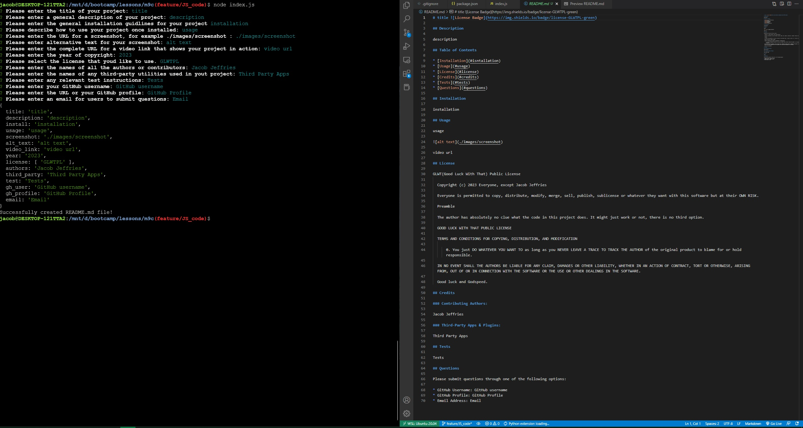

# README Builder 

## Description

This is a node.js - based CLI that takes user input and generates a custom, professional, README.md file.  By using this app, you can avoid typing a makrdown README file each time you need it.

## Table of Contents

* [Installation](#isntallation)
* [Usage](#usage)
* [License](#license)
* [Credits](#credits)
* [Tests](#tests)
* [Questions](#questions)

## Installation

Start by cloning the public GitHub repo on your local machine.  In the second step, run \"npm isntall\" at the BASH prompt to install the necessary node packages. Once the packages are installed you can run the application by typing \"node index.js\" in the BASH terminal.

## Usage

After starting the application, follow the onscreen prompts to enter your application's specific information.

https://youtu.be/bZ8WHuNoFig

## License

MIT License

  Copyright (c) 2023 Jacob Jeffries

  Permission is hereby granted, free of charge, to any person obtaining a copy of this software and associated documentation files (the "Software"), to deal in the Software without restriction, including without limitation the rights to use, copy, modify, merge, publish, distribute, sublicense, and/or sell copies of the Software, and to permit persons to whom the Software is furnished to do so, subject to the following conditions:

  The above copyright notice and this permission notice (including the next paragraph) shall be included in all copies or substantial portions of the Software.

  THE SOFTWARE IS PROVIDED "AS IS", WITHOUT WARRANTY OF ANY KIND, EXPRESS OR IMPLIED, INCLUDING BUT NOT LIMITED TO THE WARRANTIES OF MERCHANTABILITY, FITNESS FOR A PARTICULAR PURPOSE AND NONINFRINGEMENT. IN NO EVENT SHALL THE AUTHORS OR COPYRIGHT HOLDERS BE LIABLE FOR ANY CLAIM, DAMAGES OR OTHER LIABILITY, WHETHER IN AN ACTION OF CONTRACT, TORT OR OTHERWISE, ARISING FROM, OUT OF OR IN CONNECTION WITH THE SOFTWARE OR THE USE OR OTHER DEALINGS IN THE SOFTWARE.

## Credits

### Contributing Authors:

Jacob Jeffries

### Third-Party Apps & Plugins:

Node v18.13.0    NPM v8.19.3     Inquirer v8.2.4

## Tests

No applicable tests provided.

## Questions

Please submit questions through one of the following options:

* GitHub Username: Jacob-Jeffries
* GitHub Profile: https://github.com/Jacob-Jeffries
* Email Address: jeffrij85@gmail.com